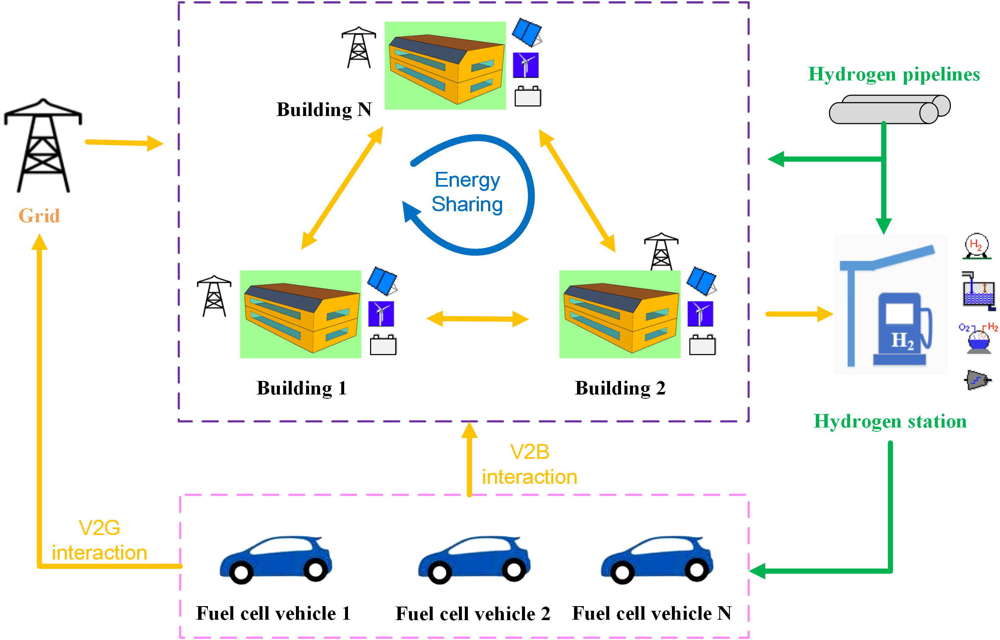

# AlphaHydrogen

AlphaHydrogen is an open source OpenAI Gym environment that simulates the energy system of a residential community with distributed renewable power supply, fuel-cell vehicles, hydrogen stations, and power grid. Its objective is to advance the control of an integrated electricity-hydrogen building-vehicle-renewable energy system.

<!--
[[slides]](docs/slides.pdf)[[paper]](https://dl.acm.org/doi/10.1145/3408308.3427980)
-->

# Overview
Cleaner power production, distributed renewable generation, building-vehicle integration, hydrogen (H2) storage and associated energy infrastructures are promising candidates for transformation towards a carbon-neutrality community with district energy flexibility enhancement. AlphaHydrogen allows the easy implementation of advanced controll agents in a multi-agent setting to achieve customized goals: load shifting, CO2 emission reduction, operational cost saving, and etc. 




# Code Usage
### Clone repository
```
git clone https://github.com/WalterZWang/AlphaHydrogen.git
cd AlphaHydrogen
```

### Set up the environment 
Set up the virtual environment with your preferred environment/package manager.

The instruction here is based on **conda**. ([Install conda](https://docs.anaconda.com/anaconda/install/))
```
conda create --name alphaHydrogen python=3.8 -c conda-forge -f requirements.txt
conda activate alphaHydrogen
```

### Repository structure
``gym_AlphaHydrogen``: Code and data to develop the OpenAI Gym environment

``docs``: Papers published with this environment

``test.ipynb``: A example case to test the environment


### Running
You can test the environment using the Jupyter notebook ``test.ipynb``

*Notes*
- Official Documentation of [OpenAI Gym](https://gym.openai.com/).

### Feedback

Feel free to send any questions/feedback to: [Zhe Wang](mailto:zwang5@lbl.gov ) or [Yingdong He](mailto:heyingdong2017@berkeley.edu)

### Citation

If you use our code, please cite us as follows:

<!--
```
@inproceedings{Chen2020COHORT,
author = {Chen, Bingqing and Francis, Jonathan and Pritoni, Marco and Kar, Soummya and Berg\'{e}s, Mario},
title = {COHORT: Coordination of Heterogeneous Thermostatically Controlled Loads for Demand Flexibility},
year = {2020},
isbn = {9781450380614},
publisher = {Association for Computing Machinery},
address = {New York, NY, USA},
url = {https://doi.org/10.1145/3408308.3427980},
doi = {10.1145/3408308.3427980},
booktitle = {Proceedings of the 7th ACM International Conference on Systems for Energy-Efficient Buildings, Cities, and Transportation},
pages = {31–40},
numpages = {10},
keywords = {demand response, smart thermostats, TCLs, distributed control},
location = {Virtual Event, Japan},
series = {BuildSys '20}
}
```
-->
